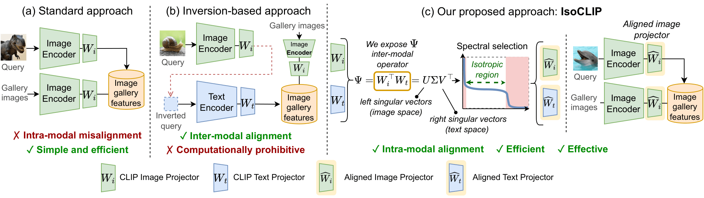

# IsoCLIP (CVPR 2026)
### Decomposing CLIP Projectors for Efficient Intra-modal Alignment
[](https://arxiv.org/abs/2603.19862)
[](https://openaccess.thecvf.com/content/CVPR2026/papers/Magistri_IsoCLIP_Decomposing_CLIP_Projectors_for_Efficient_Intra-modal_Alignment_CVPR_2026_paper.pdf) 
[](https://openaccess.thecvf.com/content/CVPR2026/supplemental/Magistri_IsoCLIP_Decomposing_CLIP_CVPR_2026_supplemental.pdf) 
[](https://www.youtube.com/watch?v=KKOsTjgMyAs)
[](https://github.com/simomagi/IsoCLIP/stargazers)


This is the **official repository** of the **CVPR 2026 paper**
"*IsoCLIP: Decomposing CLIP Projectors for Efficient Intra-modal Alignment*"
by Simone Magistri, Dipam Goswami, Marco Mistretta, Bartłomiej Twardowski, Joost van de Weijer, Andrew D. Bagdanov.

## Abstract

Vision-Language Models like CLIP are extensively used for inter-modal tasks which involve both visual and text modalities. However, when the individual modality encoders are applied to inherently intra-modal tasks like image-to-image retrieval, their performance suffers from the intra-modal misalignment. In this paper we study intra-modal misalignment in CLIP with a focus on the role of the projectors that map pre-projection image and text embeddings into the shared embedding space. By analyzing the form of the cosine similarity applied to projected features, and its interaction with the contrastive CLIP loss, we show that there is an inter-modal operator responsible for aligning the two modalities during training, and a second, intra-modal operator that only enforces intra-modal normalization but does nothing to promote intra-modal alignment. Via spectral analysis of the inter-modal operator, we identify an approximately isotropic subspace in which the two modalities are well-aligned, as well as anisotropic directions specific to each modality. We demonstrate that this aligned subspace can be directly obtained from the projector weights and that removing the anisotropic directions improves intra-modal alignment. Our experiments on intra-modal retrieval and classification benchmarks show that our training-free method reduces intra-modal misalignment, greatly lowers latency, and outperforms existing approaches across multiple pre-trained CLIP-like models.

 
 (a) Standard CLIP intra-modal retrieval is sub-optimal due to intra-modal misalignment. (b) Inversion methods are effective but add high latency. (c) IsoCLIP isolates well-aligned directions from the inter-modal operator Ψ = Wᵢᵀ Wₜ, improving intra-modal performance at no extra cost.

 


<details>
<summary><h2>Installation Guide</h2></summary> 

This guide provides step-by-step instructions on how to set up the **isoclip** conda environment and install all necessary dependencies. 

1. Create and Activate Conda Environment

```bash
conda create -y -n isoclip python=3.10.14
conda activate isoclip
```

2. Install PyTorch (with CUDA 12.1)
```bash
conda install pytorch==2.1.1 torchvision==0.16.1 pytorch-cuda=12.1 -c pytorch -c nvidia
```
3. Clone the repository and install pip dependecies
```bash
git clone https://github.com/simomagi/IsoCLIP.git
cd IsoCLIP
pip install --no-build-isolation git+https://github.com/KaiyangZhou/Dassl.pytorch
chmod +x install_requirements.sh
./install_requirements.sh
```
</details>

<details>
<summary><h2>Dataset Setup and Download </h2></summary> 

## 1. Setup Dataset Directory and Download

We recommend storing all datasets in a single directory:
```bash
mkdir -p /path/to/datasets
```
Use this path with the `--dataroot` flag when running:

```bash
python src/retrieval.py --dataroot /path/to/datasets
python src/classification/zeroshotclassification.py --dataroot /path/to/datasets
```

 Our codebase supports all datasets from  Cross-the-Gap repository: 
- Please refer to the official [Cross-the-Gap dataset documentation](https://github.com/miccunifi/Cross-the-Gap/blob/main/DATASETS.md) for download instructions.  
- For adding and setting up new datasets, see the [dataset installation guide](https://github.com/miccunifi/Cross-the-Gap/tree/main?tab=readme-ov-file#dataset-installation-guide).


## 2. Places and iNaturalist dataset
In addition, our codebase also support:

### Places

- **Download the validation set** and store it under:
```bash
/path/to/datasets/Places365_val/
├── places365_val.txt
├── places_devkit/
└── val_large/
```
-  **Official website** : http://places2.csail.mit.edu/download-private.html

### mini-iNaturalist
- **Download the iNaturalist 2021 mini-train split** and store it under:
  ```bash
  /path/to/datasets/iNaturalist2021_train/
  ├── annotations
  └── train_mini
  
- **Official website**: https://github.com/visipedia/inat_comp/tree/master/2021

</details>

<details>
<summary><h2>Reproducing Image-to-Image and Text-to-Text Retrieval</h2></summary> 

The main script for retrieval experiments is:

```bash
python src/retrieval.py
```

It supports:

* image-to-image retrieval
* text-to-text retrieval
* IsoCLIP-enabled evaluation
* standard CLIP/OpenCLIP evaluation

### Required arguments

* `--dataroot` :
  Root directory containing all datasets.

* `--dataset_name`:
  Name of the dataset to evaluate. See [data_utils.py](https://github.com/simomagi/IsoCLIP/blob/main/src/data_utils.py) for a list of dataset names.

* `--query_eval_type {image,text}`:
  Feature type used for the query set.

* `--gallery_eval_type {image,text}` :
  Feature type used for the gallery set.

### Optional arguments

* `--clip_model_name` :
  CLIP backbone to use. Default: `ViT-B/32`.

* `--no_iso` :
  Disable IsoCLIP projection. By default, IsoCLIP is enabled.

* `--iso_ktop` :
  Number of top singular directions to remove. Default: `150`.

* `--iso_kbottom` :
  Number of bottom singular directions to remove. Default: `50`.

* `--query_split` :
  Query split to evaluate. If not specified, the default split for the dataset is used. See [data_utils.py](https://github.com/simomagi/IsoCLIP/blob/main/src/data_utils.py) for default splits.

* `--gallery_split` :
  Gallery split to evaluate. If not specified, the default split for the dataset is used. See [data_utils.py](https://github.com/simomagi/IsoCLIP/blob/main/src/data_utils.py) for default splits.

* `--use_open_clip` :
  Use OpenCLIP instead of OpenAI CLIP.

* `--open_clip_pretrained` :
  Name of the OpenCLIP pretrained weights.

* `--out_path` :
  Output directory for the experiments. If not specified, a folder named `local_run_retrieval` is created by default, and the experiment is saved inside it.

## Examples

### Image-to-image retrieval with IsoCLIP

```bash
python src/retrieval.py \
    --dataroot /path/to/datasets/ \
    --dataset_name cub2011 \
    --clip_model_name ViT-B/16 \
    --query_eval_type image \
    --gallery_eval_type image \
    --iso_ktop 200 \
    --iso_kbottom 50 \
    --out_path iso_cub_img_retrieval
```

### Text-to-text retrieval with IsoCLIP

```bash
python src/retrieval.py \
    --dataroot  /path/to/datasets/  \
    --dataset_name flickr30k_text \
    --clip_model_name ViT-B/16 \
    --query_eval_type text \
    --gallery_eval_type text \
    --iso_ktop 10 \
    --iso_kbottom 50 \
    --out_path iso_flickr_txt_retrieval
```

### Standard retrieval without IsoCLIP

```bash
python src/retrieval.py \
    --dataroot /path/to/datasets/ \
    --dataset_name cub2011 \
    --clip_model_name ViT-B/16 \
    --query_eval_type image \
    --gallery_eval_type image \
    --no_iso \
    --out_path baseline_retrieval
```

### OpenCLIP evaluation

```bash
python src/retrieval.py \
    --dataroot /path/to/datasets \
    --dataset_name cub2011 \
    --clip_model_name ViT-B-16 \
    --use_open_clip \
    --open_clip_pretrained datacomp_xl_s13b_b90k \
    --query_eval_type image \
    --gallery_eval_type image \
    --out_path openclip_eval \
    --iso_ktop 100 \
    --iso_kbottom 100 \

```

###  Feature Management

When running the codebase for the first time, the required model is automatically downloaded, and the extracted image or text features are stored under the `data/` directory inside the repository.

If the same model and evaluation are executed again, the precomputed features are automatically loaded, avoiding redundant inference and significantly reducing runtime when multiple evaluations are performed with the same model and data.


## Output and Results Organization

Each run:

- prints metrics to the terminal  
- creates a unique folder  
- saves a `summary.csv` with configuration and results  

### Folder structure

```bash
results/<out_path>/exp_<timestamp>_<random_tag>/
```

or (if `--out_path` is not set):

```bash
local_run_retrieval/exp_<timestamp>_<random_tag>/
```

### summary.csv

The file contains a **single-row summary** with:

- **configuration**: dataset, model, eval types, splits, ISO parameters, OpenCLIP settings  
- **metrics**: `mAP`, `mAP_at_R`, `precision_at_R`, `recall_at_1`  
- **dataset-specific metrics** (e.g. Oxford/Paris mAP variants)  
- **metadata**: `folder_path`, `timestamp`  

### Notes

- Some metrics may be empty depending on the dataset  
- Designed for easy aggregation across multiple runs. Use [aggregate_retrieval.py](https://github.com/simomagi/IsoCLIP/blob/main/aggregate_retrieval.py) to aggregate multiple `summary.csv` files within the same `out_path` folder.

## Bash Scripts for running all the evaluation:

We provide bash scripts to run retrieval experiments for each model.

- `exp_img-img_retrieval/`: image-to-image retrieval  
- `exp_txt-txt_retrieval/`: text-to-text retrieval  

Each script corresponds to a specific model (e.g. `clip_b32_img_retrieval.sh`).

Before running, set:

```bash
PYTHON=""    # Python executable
ROOT_DIR=""  # Repository root
DATA_ROOT="" # Dataset root
```
Run a script as:
```bash
cd exp_img-img_retrieval
bash clip_b32_img_retrieval.sh
``` 

</details>

<details>

 <summary><h2> Reproducing Image Classification </h2></summary> 

The procedure is similar to the retrieval one. Run:

```bash
python src/classification/zero_shot_classification.py
```

Supports:

- `zeroshot` → CLIP zero-shot  
- `ncm` → NCM with CLIP features  
- `iso_ncm` → NCM with IsoCLIP  

---

### Required

```
--dataroot      # dataset root
--dataset_name  # e.g. caltech101, oxford_pets, ...
```

---

### Key arguments

```
--eval-type {zeroshot,ncm,iso_ncm}
--clip_model_name ViT-B/32
--iso_ktop 150        # only for iso_ncm
--iso_kbottom 50     # only for iso_ncm
--use_open_clip
--open_clip_pretrained <name>
--out_path <dir>      # default: local_run_classification
```
---

### Example

```bash
python src/classification/zero_shot_classification.py \
    --dataroot /path/to/datasets \
    --dataset_name caltech101 \
    --eval-type iso_ncm \
    --clip_model_name ViT-B/32 \
    --iso_ktop 150 \
    --iso_kbottom 50 \
    --out_path iso_classification
```

---

### Output

Each run:

- prints accuracy  
- creates:
  ```
  <out_path>/exp_<timestamp>_<tag>/
  ```
- saves:
  ```
  classification_summary.csv
  ```

The CSV contains: dataset, model, eval type, ISO params, and accuracy.

## Bash Scripts for Running the Evaluations

We provide bash scripts to run classification experiments for each model.

- `exp_img_classification/`: image classification experiments  

Each script corresponds to a specific model (e.g. `clip_b32_classification.sh`).

Before running, set:

```bash
PYTHON=""    # Python executable
ROOT_DIR=""  # Repository root
DATA_ROOT="" # Dataset root
```

Run a script as:

```bash
cd exp_img_classification
bash clip_b32_classification.sh
```

The output directory is automatically set to the script name (without `.sh`). Use [aggregate_classification.py](https://github.com/simomagi/IsoCLIP/blob/main/aggregate_classification.py)  to aggregate multiple classification_summary.csv files within the same folder. 
</details>

<details open>
<summary><h2>How to Use IsoCLIP on Your CLIP Model</h2></summary>

This notebook provides a minimal demo of how to apply **IsoCLIP** to a pre-trained CLIP model.  
It shows how to:

- load a CLIP model
- modify the image forward pass to extract **pre-projection features**
- extract the image and text projection layers
- compute the **IsoCLIP** projectors
- apply them in a simple forward pass 

---

### 🚀 Demo

👉 **[Open Demo Notebook](./demo_iso.ipynb)**  

The notebook is intended as a lightweight example of the IsoCLIP pipeline, from model loading to the computation of IsoCLIP-transformed features.

> **Adapting IsoCLIP to new CLIP-style models**
>
> The codebase is tested on the CLIP-like models and task used in the paper.  
> For other CLIP-style models, you may need to adapt the model-specific code for:
>
> - model loading (`utils.load_clip`)
> - projector extraction (`encode_no_projection.get_projection_layers`)
> - pre-projection image/text features  
>   (`get_encode_image_with_noproj`, `get_encode_text_with_noproj`)
> - architecture-specific attention handling (`encode_attention_module`)
>
> Before running IsoCLIP on a new model, check that the projection layers are identified correctly and that image/text features are extracted **before** the final projection head. Differences in pooling, projection, or encoder implementation are the most common source of integration issues.

</details>

## IsoCLIP Citation

If you find this work useful, please consider citing:

```bibtex
@InProceedings{Magistri_2026_CVPR,
    author    = {Magistri, Simone and Goswami, Dipam and Mistretta, Marco and Twardowski, Bart{\l}omiej and van de Weijer, Joost and Bagdanov, Andrew D.},
    title     = {IsoCLIP: Decomposing CLIP Projectors for Efficient Intra-modal Alignment},
    booktitle = {Proceedings of the IEEE/CVF Conference on Computer Vision and Pattern Recognition (CVPR)},
    month     = {June},
    year      = {2026},
    pages     = {29315-29324}
}

```

## Acknowledgements

Our codebase builds upon [Cross-the-Gap](https://github.com/miccunifi/Cross-the-Gap).
If you find this codebase useful for your research, please also consider citing Cross the Gap:
```bibtex
@inproceedings{mistretta2025cross,
  title={Cross the Gap: Exposing the Intra-modal Misalignment in CLIP via Modality Inversion},
  author={Marco Mistretta and Alberto Baldrati and Lorenzo Agnolucci and Marco Bertini and Andrew D. Bagdanov},
  booktitle={The Thirteenth International Conference on Learning Representations},
  year={2025},
  url={https://openreview.net/forum?id=VVVfuIcmKR}
}
```

## License

This project is licensed under the MIT License. See [LICENSE](LICENSE) for details. 
 
